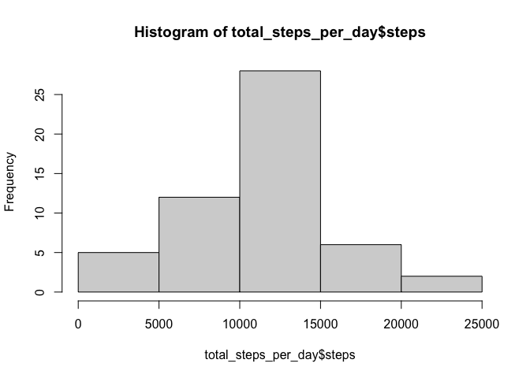
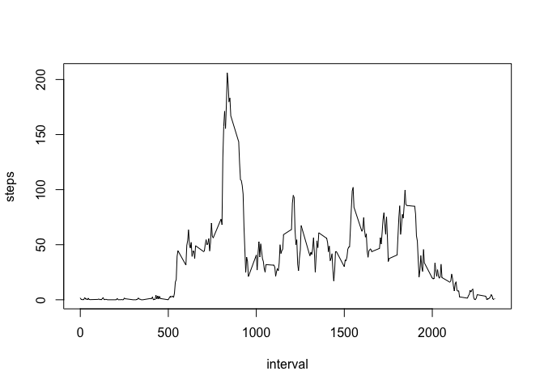
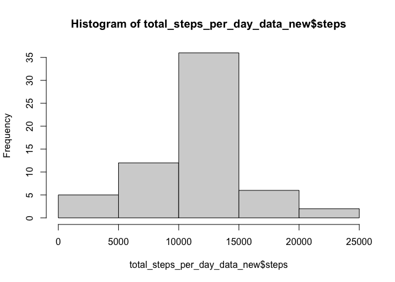
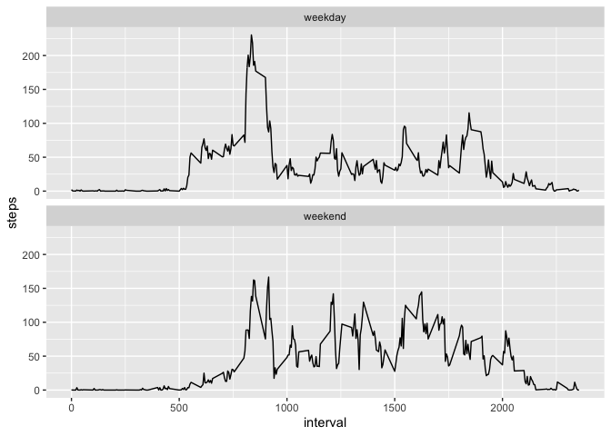

Set up packages

```r
library(knitr)
library(dplyr)
```

```
## 
## Attaching package: 'dplyr'
```

```
## The following objects are masked from 'package:stats':
## 
##     filter, lag
```

```
## The following objects are masked from 'package:base':
## 
##     intersect, setdiff, setequal, union
```

```r
library(ggplot2)
```


## Loading and preprocessing the data
Assuming you are working in your project containing the data...
Load in the data

```r
data <- read.csv("activity.csv")
```


## What is mean total number of steps taken per day?
Get total steps per day, make histogram

```r
total_steps_per_day <- aggregate(steps~date,data,sum)
hist(total_steps_per_day$steps)
```

<!-- -->

Get mean and median of each day

```r
mean(total_steps_per_day$steps)
```

```
## [1] 10766.19
```

```r
median(total_steps_per_day$steps)
```

```
## [1] 10765
```


## What is the average daily activity pattern?
Get average steps per interval

```r
average_steps_per_interval <- aggregate(steps~interval,data,mean)
plot(average_steps_per_interval, type="l")
```

<!-- -->

Get interval of max average steps

```r
max_interval<-max(average_steps_per_interval$steps)
subset(average_steps_per_interval, steps==max_interval)
```

```
##     interval    steps
## 104      835 206.1698
```

Get number of missing values

```r
sum(is.na(data$steps))
```

```
## [1] 2304
```


## Imputing missing values
Replace missing values

```r
data_new <- data
for (i in 1:nrow(data_new)) {
  if (is.na(data_new$steps[i])) {
     int_i <- data_new$interval[i]
     int_sub<-subset(average_steps_per_interval, interval==int_i)
     data_new$steps[i] <- int_sub$steps
  }
}
```


Get new total steps per day, make histogram

```r
total_steps_per_day_data_new <- aggregate(steps~date,data_new,sum)
hist(total_steps_per_day_data_new$steps)
```

<!-- -->

Get mean and median of new total steps per day

```r
mean(total_steps_per_day_data_new$steps)
```

```
## [1] 10766.19
```

```r
median(total_steps_per_day_data_new$steps)
```

```
## [1] 10766.19
```


## Are there differences in activity patterns between weekdays and weekends?
Collect day and type of day data, add to new table

```r
data_new$day_of_week <- weekdays(as.Date(data_new$date))
data_new$type_of_day <- ifelse(data_new$day_of_week=="Saturday" | data_new$day_of_week=="Sunday", "weekend", "weekday")
```

Create time series plot for weekends and weekdays

```r
data_new_days_steps_by_interval <- aggregate(steps ~ interval + type_of_day, data_new, mean)
qplot(interval, steps, data = data_new_days_steps_by_interval, geom=c("line")) + 
  facet_wrap(~ type_of_day, ncol = 1)
```

<!-- -->
